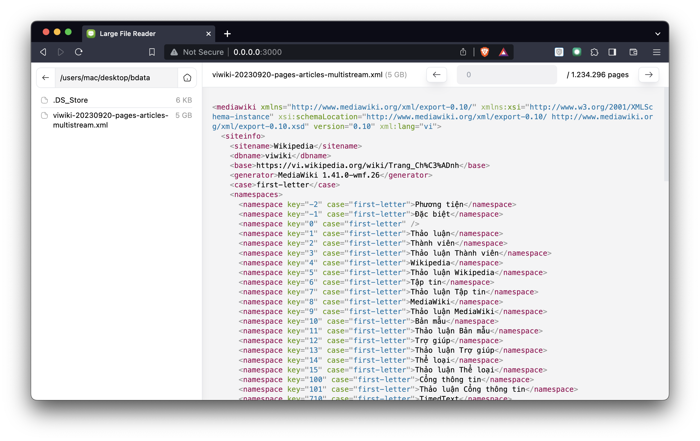

# Large file reader

Large file reader is a web (with nodejs) application for reading part of a very big file. It will paginate the file content and display it on the main site.

## Installation

1. Clone `git clone https://github.com/hieunc229/large-file-reader.git`, and navigate to the repo directory
2. (optional) Edit `ROOT_DIR` in `.env` to your default root folder. It must be an absolute path to an existing directory
3. Run the server `node server/index.js`

Now, the application should be available via `http://localhost:3000`

## Usage

1. Visit `http://localhost:3000`
2. Use the Finder view (the left panel) to navigate to your file
3. Click the file to view its content

## Changelog

- Added Finder view to browse files/directories