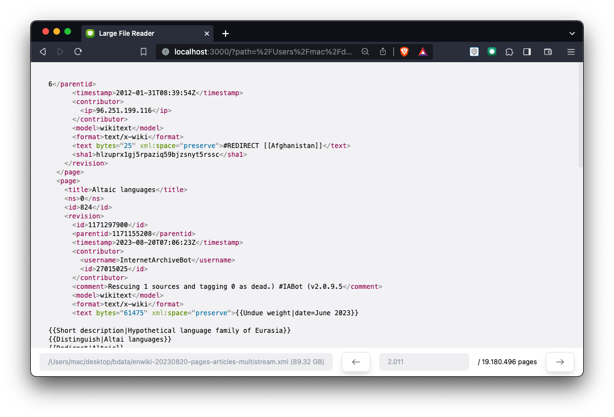

# Large file reader

Large file reader is a web (with nodejs) application for reading part of a very big file. It will paginate the file content and display it on the main site.

## Installation

1. Clone `git clone https://github.com/hieunc229/large-file-reader.git`, and navigate to the repo directory
2. Run the server `node server/index.js`

Now, the application should be available via `http://localhost:3000`

## Usage

1. Visit `http://localhost:3000`
2. Enter the file absolute location in the the `File Path` text box, then press `Enter`
3. If the file location exist, it'll display the content of the first page

